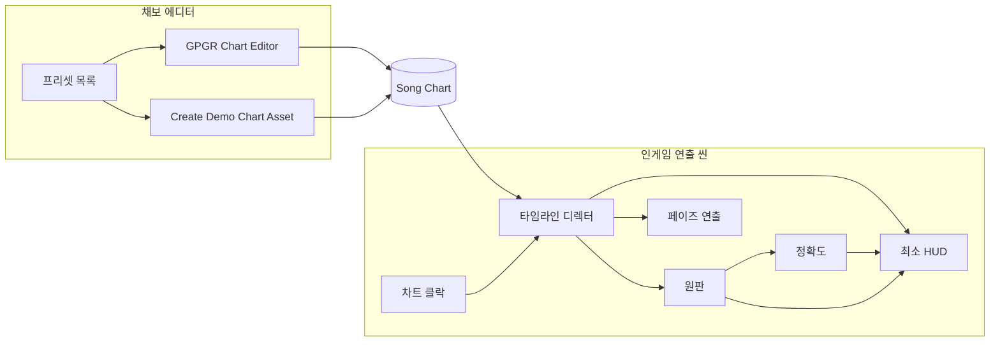
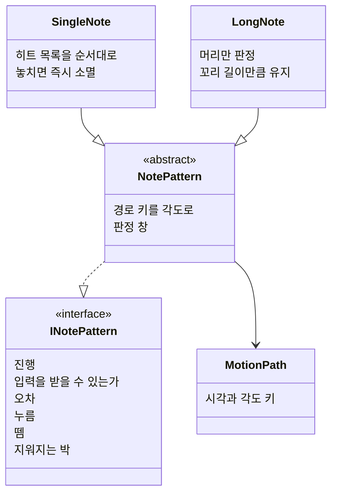
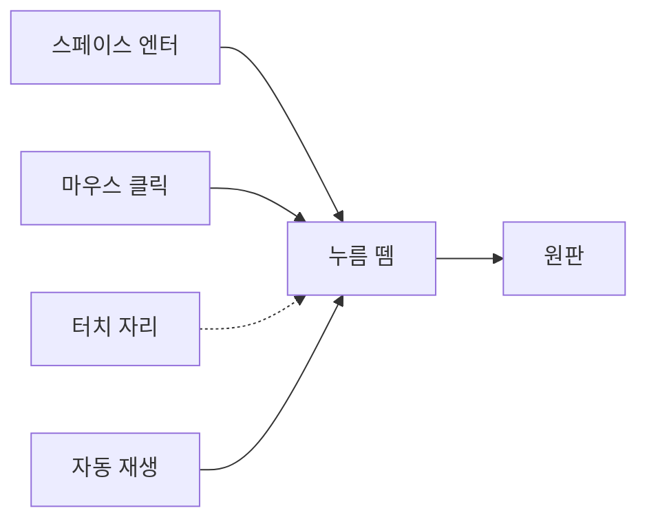
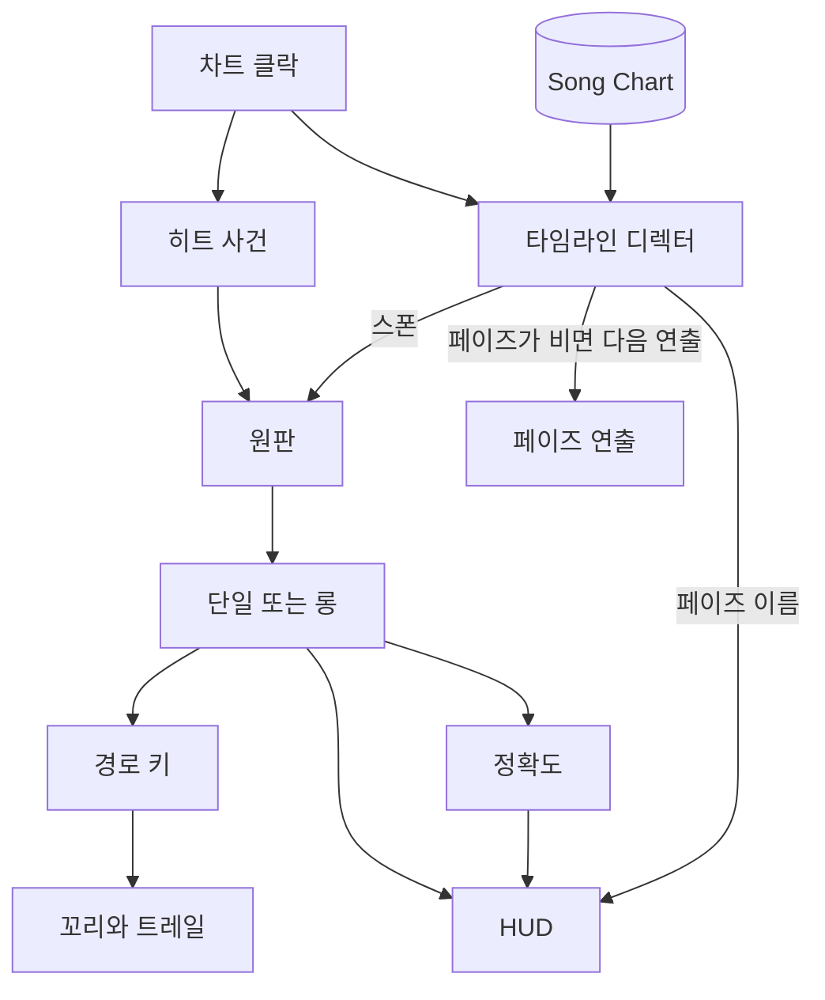
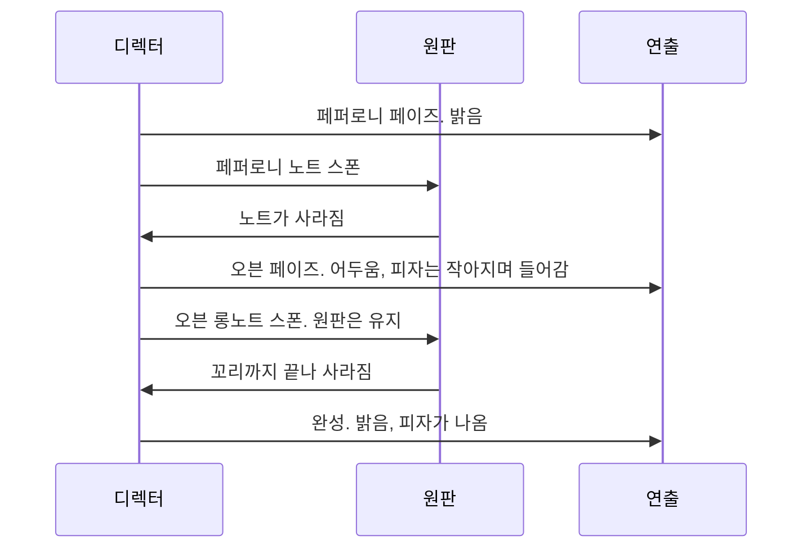

# Unity 구조

**기준:** `Docs/좋은_피자_위대한_리듬_기획서.md`  
**범위:** 트레일러용 인게임 씬과 채보 에디터. 손님·경영·스테이지 선택, 피자에 재료가 붙는 컷, 타격 이펙트는 영상 편집이다.

에디터는 `Song Chart` 에셋을 쓰고, 인게임은 그 에셋을 읽기만 한다. 판정 원판은 한 벌이며, 에디터 미리보기와 트레일러 재생이 같은 원판을 쓴다.

이 문서의 데모 채보는 반죽 → 토마토 소스 → 치즈 뿌리기 → 페퍼로니 → 오븐 → 완성이다. 그 목록은 데이터다. 디렉터와 원판은 재료 이름으로 분기하지 않는다.

---

## 1. 누가 무엇을 가지는가



| 자리 | 하는 일 |
| --- | --- |
| 채보 에디터 | 페이즈 순서, 노트 행, 판정 표, 재생 방식을 에셋에 저장한다. |
| Song Chart | 둘 사이의 계약. 노트 한 줄의 박자는 페이즈 시작 기준이다. |
| 인게임 | 페이즈를 곡 박자로 펼치고, 경로를 따라 노트를 두고, 판정·정확도·배경·오븐·완성을 보여 준다. |

---

## 2. 공유 데이터

`Song Chart`

- BPM
- 오프셋. 클락은 오디오 시각에 이 값을 더한다.
- 기본 접근 박자. 기본값 2박. 프리셋이 첫 경로 키의 시각을 만들 때 쓴다.
- 기본 스폰 각 180°, 히트 각 270°. 이동 각 +90°는 두 값의 차이라서 따로 저장하지 않는다. 행에서 스폰 각과 히트 각을 덮어쓸 수 있다.
- 오디오 클립. 곡이 오기 전에는 비어 있어도 되고, BPM만으로 미리보기가 돈다.
- 판정 창과 정확도 감점. 아래 표가 기본값이고, 에셋에서 바꾼다.
- 재생 방식. 트레일러는 자동 재생이다.
- 페이즈 배열.

판정 기본값:

| 판정 | 윈도우 | 정확도 | 트레일러 자동 재생 |
| --- | --- | --- | --- |
| Perfect | ≤ 50ms | 0 | 쓴다 |
| Good | ≤ 100ms | −2%p | 쓴다 |
| Bad | ≤ 160ms | 숫자는 둔다 | 나오지 않는다 |
| Miss | 그 밖 | 숫자는 둔다 | 나오지 않는다 |

윈도우가 서로 겹치므로 위에서부터 먼저 맞는 줄을 쓴다. 오차 30ms는 Perfect다.

정확도는 100%에서 시작하고 0%~100%로 클램프한다. 자동 재생은 Good과 Perfect를 섞는다. 트레일러 게이지는 0 또는 −2만 움직인다.

### 페이즈

페이즈는 이름 있는 묶음이다. 디렉터는 분기에 이름을 쓰지 않는다. 이름은 HUD로 그대로 넘기고, 연출은 아래 필드만 읽는다.

| 필드 | 뜻 |
| --- | --- |
| 노트 행 | 완성처럼 비어 있을 수 있다. |
| 유지 박 | 노트가 없는 페이즈가 연출로 버티는 박. 노트가 있으면 지워지는 박과 비교해 더 긴 쪽을 쓴다. |
| 배경 | 밝음 또는 어두움. |
| 피자 | 없음, 오븐으로 들어감, 오븐에서 나옴. |
| 원판 틴트 | 색 하나. 비워 두면 직전 색을 유지한다. 원판 위치와 하단 히트 라인은 어느 페이즈에서도 바뀌지 않는다. |

데모에서의 값:

| 페이즈 | 배경 | 피자 | 원판 틴트 | 유지 박 |
| --- | --- | --- | --- | --- |
| 반죽, 토마토 소스, 치즈, 페퍼로니 | 밝음 | 없음 | 비움 | 0 |
| 오븐 | 어두움 | 오븐으로 들어감 | 비움 | 0 |
| 완성 | 밝음 | 오븐에서 나옴 | 비움 | 노트가 없으니 값이 있어야 한다 |

데모에서는 반죽·소스·치즈·페퍼로니의 연출 값이 모두 같다. 이 네 페이즈의 구분은 노트 아이콘과 색이 하고, 배경이 실제로 바뀌는 곳은 오븐과 완성뿐이다. 틴트는 필요해지면 쓸 자리로 비워 둔다.

피자 레이어에 소스·치즈·토핑이 붙는 그림은 만들지 않는다.

한 페이즈의 노트가 원판에서 모두 사라진 뒤에 다음 페이즈가 시작한다. 페이즈끼리 노트가 겹치지 않는다. 끝난 뒤에 쉬는 박을 더하지 않는다. 다음 페이즈의 첫 스폰은 이전 페이즈가 비워진 박에 왼쪽에서 나온다.

비워진 박은 채보 데이터로만 정한다. 판정 결과로 노트가 예정보다 일찍 사라져도 페이즈 경계를 앞당기지 않는다. 그래야 페이즈 원점이 곡 박자에 고정되고, 오디오와 어긋나지 않는다.

```text
페이즈의 가장 이른 스폰 박 = min(행마다 첫 경로 키의 시각)
페이즈가 비워지는 박 = max(행마다 지워지는 박, 유지 박)
다음 페이즈 원점 = 이전 페이즈가 비워지는 박 − 다음 페이즈의 가장 이른 스폰 박
```

스폰 박은 행의 첫 경로 키 시각이다. 접근 박은 행에 저장하지 않고, 프리셋이 첫 키 시각을 `히트 박 − 접근 박`으로 만들 때만 쓴다. 접근 박이 행마다 다를 수 있으니, 히트가 가장 이른 행이 아니라 첫 키가 가장 이른 행을 쓴다. 페퍼로니처럼 접근 박이 짧은 행이 섞여도 이전 페이즈와 겹치지 않는다. 원점을 이렇게 두면 가장 이른 스폰이 비워진 박과 같다. 같은 페이즈 안의 노트끼리는 원판에 같이 있을 수 있다.

### 노트 행

행은 입력, 경로, 수명, 보기를 나눈다. 치즈용 칸이나 페퍼로니용 칸은 두지 않는다.

| 묶음 | 필드 | 뜻 |
| --- | --- | --- |
| 입력 | 종류 | 단일 또는 롱. |
| 입력 | 히트 시각들 | 페이즈 기준 박의 목록. 소스·페퍼로니 1개, 치즈 2개. 롱노트는 머리 1개. |
| 입력 | 놓치면 | 단일의 기본은 그 노트를 바로 지운다. 남은 히트와 그 뒤 경로는 가지 않는다. |
| 경로 | 키 | 시각과 각도. 아래 원판 절. |
| 수명 | 꼬리 길이 | 롱노트만. 머리가 히트 라인에 도착한 뒤 노트가 남아 있는 박. 꼬리가 덮는 원호도 이 값에서 나온다. 숫자는 아직 비어 있다. |
| 보기 | 아이콘과 색 | 재료를 구분하는 값. 트레일도 이 색을 쓴다. |

히트가 하나 늘거나 각도가 한 번 더 꺾이면 목록에 항목을 추가한다. 행 형식과 원판은 그대로다.

### 프리셋

프리셋은 노트 행 템플릿이다. 에디터는 등록된 프리셋 목록을 보여주고, 데모 차트는 그 목록의 순서로 페이즈를 만든다. 재료를 추가하면 프리셋 하나를 등록한다.

| 프리셋 | 입력 | 경로 |
| --- | --- | --- |
| 반죽 | 롱, 머리 1 | 기본 호. 도착 후 꼬리. |
| 토마토 소스 | 단일, 히트 1 | 기본 호. |
| 치즈 뿌리기 | 단일, 히트 2 | 기본 호 뒤에, 스폰 쪽으로 갔다가 하단으로 돌아오는 키. |
| 페퍼로니 | 단일, 히트 1 | 기본 호. 접근 박만 짧다. |
| 오븐 | 롱, 머리 1 | 기본 호. 도착 후 꼬리. |
| 완성 | 노트 없음 | 페이즈 연출만. |

---

## 3. 노트 동작

원판은 인터페이스만 호출한다.



입력 종류와 경로는 따로다. 단일·롱은 키를 어떻게 판정하는지고, 경로 키는 그 사이 각도가 어떻게 움직이는지다. 치즈의 튕김은 롱/단일 분기가 아니라 경로 키다. 페퍼로니의 속도는 키 사이의 박자다.

맞은 횟수, 마지막 판정, 이미 지나온 각도는 노트에 둔다. 패턴 객체는 노트를 저장하지 않는다.

롱노트는 머리 시각만 판정한다. 손을 떼는 시각은 보지 않는다. 머리가 판정된 뒤 꼬리 길이만큼 원판에 남고, 그 동안 꼬리는 머리가 최근 꼬리 길이만큼의 박 동안 지나온 원호를 채운다. 꼬리 길이가 끝나면 노트가 사라진다.

단일 노트의 히트가 가장 넓은 판정 창(Bad, 160ms)까지 지나면 Miss이고, 그 노트는 바로 사라진다. 치즈는 첫 타를 놓치면 튕기지 않는다. 자동 재생에서는 이 경우가 나오지 않는다.

빈 입력은 감점하지 않는다. 원판은 입력을 받겠다는 노트 중 오차가 가장 작은 하나에만 넘긴다. 오차가 같으면 더 이른 박이다.

새 입력 규칙이 필요하면 `NotePattern`을 상속한다. 새 움직임은 경로 키로 넣고, 키로 표현이 안 될 때만 경로 계산을 덮어쓴다. 원판과 디렉터는 그대로다.

---

## 4. 원판을 도는 방식

피자 그림, 링, 하단 히트 표시는 고정이다. 노트만 경로 키를 따라 움직인다. 맞았는지는 충돌이 아니라 곡 박자다. 키의 각도가 히트 각인 시각이 히트 시각과 같으면, 화면에서는 하단에 맞물린다.

각도 기준은 오른쪽이 0°, 반시계가 양수다. 왼쪽이 180°, 하단이 270°다.

매 프레임 각도는 직전 프레임에 속도를 더하지 않는다. 현재 박에서 경로 키를 읽어 보간한다. 키와 키 사이는 적힌 부호 있는 각도만큼 움직인다. 짧은 쪽으로 자동으로 꺾지 않는다.

기본 호는 키 두 개다.

```text
(히트 박 − 접근 박, 180°)
(히트 박, 270°)
```

```text
x = 중심 x + 반지름 × cos(각도)
y = 중심 y + 반지름 × sin(각도)
```

노트마다 키가 다르다. 공유하는 것은 중심과 반지름뿐이다. 아이콘은 궤도를 따라 이동하고 세로는 유지한다.

치즈 프리셋은 첫 히트 뒤에 키를 두 개 더 둔다. 하나는 스폰 방향인 각도 감소, 하나는 하단으로 복귀다. **두 번째 히트는 다시 하단에 도착한 시각**이다. 되돌아가는 각도와 그 박자는 아직 비어 있다.

롱노트의 머리는 기본 호로 하단에 도착한 뒤 그 각도에 머문다. 꼬리는 그 시각부터 꼬리 길이만큼 원판에 남는 몸통이다. 꼬리가 덮는 원호는 따로 저장하지 않고, 머리가 최근 꼬리 길이만큼의 박 동안 지나온 구간으로 구한다. 값은 꼬리 길이 하나뿐이다.

머리가 멈춰 있으니 이 구간은 히트 순간에 가장 길고, 박이 지날수록 하단 쪽으로 줄어들다가 꼬리 길이가 끝나는 박에 0이 되어 노트가 사라진다. 꼬리 길이가 접근 박과 같으면 히트 순간의 꼬리가 스폰 각까지 닿는다.

트레일과 같은 경로 기록을 쓰되, 꼬리는 노트 몸통이고 트레일은 그 뒤를 따르는 잔상이다.

### 트레일

트레일은 패턴이 아니라 보이는 쪽이다. 경로 기록의 뒤를 따른다.

- 노트가 원판에 있는 동안 켜 둔다.
- 각도가 되돌아가도 실제 기록된 점을 따라간다.
- 노트가 사라지면 트레일도 같이 사라진다.
- 색은 행의 색을 그대로 쓴다.
- 길이, 두께, 페이드는 연출 값이다.

---

## 5. 입력과 자동 재생

누르기와 떼기는 같은 통로로 들어온다. 키보드, 마우스, 터치, 자동 재생이 같은 사건으로 원판에 들어온다. 판정에 쓰는 것은 누름뿐이다. 롱노트도 머리만 보므로 뗌은 자리만 열어 두고 판정을 바꾸지 않는다.



트레일러 씬은 자동 재생을 쓴다. 자동 재생은 각 히트 시각에 **Good과 Perfect를 섞어** 고른 뒤, 그 판정이 나오는 오차로 누름을 보낸다. Perfect는 오차 0, Good은 50ms 초과 100ms 이하에서 고른다. 원판의 판정 계산은 사람 입력과 같다. 트레일러에서 Bad와 Miss가 나오지 않게 사람이 치는 테이크를 쓰지 않는다.

키보드 Space / Enter와 마우스 클릭은 미리보기와 확인용으로 남겨 둔다. 터치는 같은 사건으로 받을 자리만 연다.

최소 HUD는 현재 페이즈 이름, 정확도, 판정 팝업이다. 체크리스트, 말풍선, 재료 트레이는 이 씬에 없다.

---

## 6. 인게임 한 프레임



디렉터는 페이즈 연출을 적용하고, 그 페이즈 노트를 스폰한 뒤, `지워지는 박`이 모두 지날 때까지 기다린다. 오븐인지 완성인지는 보지 않고 페이즈의 배경·피자·원판 틴트 필드만 적용한다.



---

## 7. 채보 에디터

메뉴는 `GPGR/Chart Editor`와 `GPGR/Create Demo Chart Asset`이다.

에디터는 페이즈 목록, 각 페이즈의 연출 필드, 노트 행의 히트 시각과 경로 키를 고친다. 프리셋을 고르면 그 템플릿으로 행이 채워지고, 시각과 각도는 이어서 고칠 수 있다. 데모 생성은 등록된 프리셋 순서로 에셋 하나를 만든다.

미리보기는 같은 원판이다. 히트 사건은 자동 재생 또는 사람 입력(키보드·마우스) 중 에셋의 재생 방식에 적힌 쪽을 쓴다.

---

## 8. 아직 숫자만 비어 있는 것

- 롱노트 꼬리 길이. 꼬리가 덮는 원호는 여기서 나온다.
- 치즈가 되돌아가는 각도와 두 번째 히트까지의 박
- 페퍼로니 접근 박
- 완성 페이즈의 유지 박
- 재료별 노트 아이콘과 색 값
- 트레일 길이, 두께, 페이드
- Bad와 Miss의 정확도 감점 수치. 트레일러에는 안 나오지만 표를 채워야 한다.
- Good과 Perfect를 섞는 비율
- 원판 중심과 반지름
