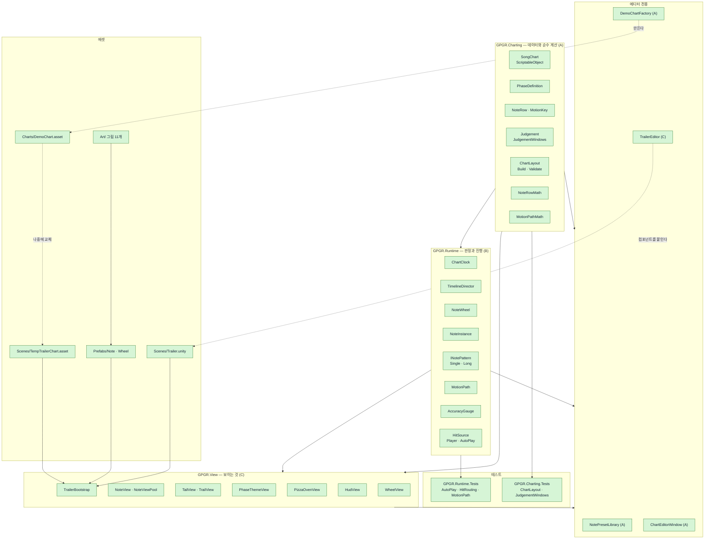
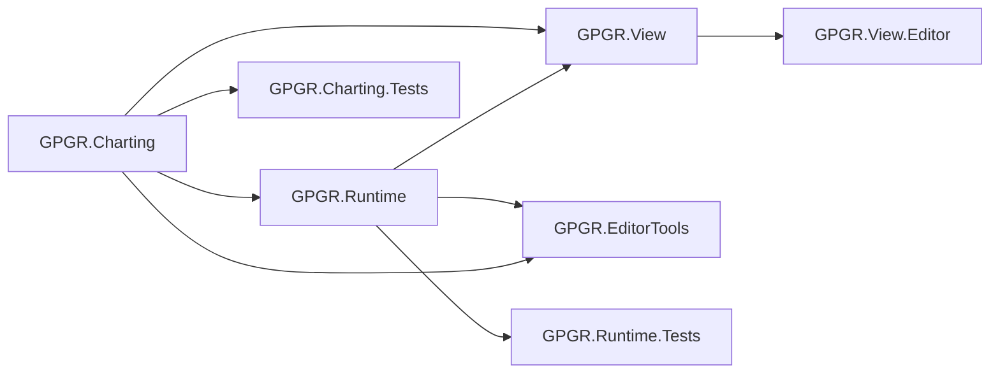

# 진행 상황과 아키텍처 현황

이 문서는 **지금 이 순간의 사실**을 적는다. 설계 의도는 `작업_계약.md`, 게임 규칙은 `좋은_피자_위대한_리듬_기획서.md`와 `Unity_구조.md`를 본다.

기준 시각: 2026-09-23 01:30 (UTC+9)
확인 방법: `Assets/GPGR` 전체 파일 목록 + `unity command recompile_status` + 씬 파일의 guid 참조 검사

---

## 1. 한눈에 보기

| 어셈블리 | 담당 | 파일 | 상태 |
|---|---|---|---|
| `GPGR.Charting` | A | 6개 + 테스트 2개 | 구현 완료, 컴파일 통과 |
| `GPGR.EditorTools` | A | 3개 | 구현 완료, 컴파일 통과 |
| `GPGR.Runtime` | B | 12개 + 테스트 3개 | 구현 완료, 컴파일 통과 |
| `GPGR.View` | C | 9개 | 구현 완료, 컴파일 통과 |
| `GPGR.View.Editor` | C | 1개 | 계약에 없던 추가 어셈블리 |
| 씬 / 프리팹 / 아트 | C | Trailer.unity, 프리팹 2개, 그림 11개 | 존재함 |
| `Charts/DemoChart.asset` | A | 4429바이트 | 생성됨 (01:27) |

**전체 컴파일이 초록이다.** `recompile_status`가 `failed: false`, 오류 0개다.

**남은 것 하나:** `Trailer.unity`가 아직 A의 `DemoChart.asset`이 아니라 C의 임시 채보를 물고 있다. 자세한 것은 6절.

---

## 2. 전체 아키텍처

색으로 상태를 구분한다.

- 초록 = 파일이 있고 컴파일을 통과했다
- 빨강 = 파일은 있는데 컴파일이 깨졌다
- 회색 점선 = 아직 파일이 없다



지금은 빨강과 회색이 없다. 파일은 전부 있고 전부 컴파일된다. 다만 위 그림에서 `DEMO -.->|나중에 교체| TMP` 화살표는 **아직 일어나지 않은 일**이다.

### 의존 방향

한 방향으로만 흐른다. 거꾸로 가는 참조는 없다.



`GPGR.Runtime/AssemblyInfo.cs`가 `InternalsVisibleTo("GPGR.Runtime.Tests")`를 열어 둔다. 그래서 B의 테스트는 `internal` 멤버까지 볼 수 있다.

---

## 3. 한 프레임에 무슨 일이 일어나는가

```mermaid
sequenceDiagram
    participant Clock as ChartClock
    participant Dir as TimelineDirector
    participant Wheel as NoteWheel
    participant Note as NoteInstance
    participant Hit as HitSource
    participant Gauge as AccuracyGauge
    participant View as GPGR.View

    Clock->>Clock: 흐른 시간을 박으로 바꾼다
    Clock->>Dir: 지금 박
    Dir->>Dir: ChartLayout이 만든 PhaseWindow로<br/>지금 페이즈를 고른다
    Dir->>Wheel: 스폰할 행을 넘긴다
    Wheel->>Note: NoteInstance를 만든다
    Note->>Note: MotionPath로 지금 각을 구한다
    Hit->>Wheel: 누름 (사람 또는 자동)
    Wheel->>Note: 가장 가까운 노트에 전달
    Note->>Note: INotePattern이 판정한다
    Note->>Gauge: 판정 결과
    Gauge->>View: 정확도
    Dir->>View: 페이즈 이름과 테마
    Note->>View: 각도와 상태
```

---

## 4. 계약과 달라진 것

에이전트들이 작업하면서 계약에 없던 것을 만들었다. 문제는 아니지만 기록해 둔다.

| 항목 | 계약 | 실제 | 판단 |
|---|---|---|---|
| 씬 빌더 위치 | `AgentScripts/C_BuildTrailerScene.cs` (Assets 밖) | `Assets/GPGR/View/Editor/TrailerEditor.cs`, 메뉴 `GPGR/View/Add Runtime Components` | 더 낫다. 에디터 메뉴로 다시 돌릴 수 있고 버전 관리도 된다. `AgentScripts/` 폴더는 결국 안 쓰였다 |
| `GPGR.View.Editor` | 없음 | C가 새로 만듦 | 위와 같은 이유. View 전용이라 남의 영역을 안 건드린다 |
| C가 쓸 채보 | A의 `DemoChart.asset`을 기다린다 | `Scenes/TempTrailerChart.asset`을 직접 만들어 씀 | 지침대로다. A의 것이 나오면 교체해야 한다 |
| B의 테스트 | 계약에 명시 안 함 | `Runtime/Tests/` 3개 + `AssemblyInfo.cs` | 좋다 |
| `NoteViewPool` | 계약에 없음 | C가 추가 | 노트 재사용은 필요하다 |

---

## 5. 파일별 역할

파일 **존재는 직접 확인했다.** 아래 역할 설명은 계약 문서에 적어 둔 의도이고, 각 파일 안을 한 줄씩 다 읽어 확인한 것은 아니다.

### GPGR.Charting (A)
| 파일 | 역할 |
|---|---|
| `SongChart.cs` | 곡 하나의 채보. BPM, 페이즈 목록, 판정 윈도우 |
| `PhaseDefinition.cs` | 페이즈 하나. 이름, 행 목록, 배경, 원판 틴트, 유지 박 |
| `NoteRow.cs` | 행 하나. 히트 박, 꼬리 박, 경로 키, 아이콘, 색 / `MotionKey` |
| `Judgement.cs` | Perfect·Good·Bad·Miss와 `JudgementWindows.Classify` |
| `ChartLayout.cs` | 페이즈 원점을 계산해 `PhaseWindow` 목록을 만든다. `Validate`로 채보 오류를 찾는다 |
| `NoteRowMath.cs` | 스폰 박, 히트 박, 비워지는 박 계산 |
| `MotionPathMath.cs` | 경로 키 사이 각도 보간. B의 `MotionPath`가 이걸 부른다 |

### GPGR.Runtime (B)
| 파일 | 역할 |
|---|---|
| `ChartClock.cs` | 시간을 박으로 바꾼다 |
| `TimelineDirector.cs` | 페이즈를 넘기고 스폰 시점을 정한다 |
| `NoteWheel.cs` | 노트를 만들고 누름을 가장 가까운 노트에 보낸다 |
| `NoteInstance.cs` | 노트 하나의 상태 |
| `INotePattern.cs` / `NotePattern.cs` / `SingleNotePattern.cs` / `LongNotePattern.cs` | 노트 종류별 판정 규칙 |
| `MotionPath.cs` | `MotionPathMath.AngleAt` 래퍼 |
| `AccuracyGauge.cs` | 정확도 누적 |
| `HitSource.cs` / `PlayerHitSource.cs` / `AutoPlayHitSource.cs` | 사람 입력과 자동 연주 |

### GPGR.View (C)
| 파일 | 역할 |
|---|---|
| `TrailerBootstrap.cs` | 씬에서 런타임과 뷰를 엮는다 |
| `WheelView.cs` | 원판 |
| `NoteView.cs` / `NoteViewPool.cs` | 노트 그림과 재사용 |
| `TailView.cs` / `TrailView.cs` | 롱노트 꼬리, 잔상 |
| `PhaseThemeView.cs` | 배경과 원판 틴트 전환 |
| `PizzaOvenView.cs` | 피자와 화덕 연출 |
| `HudView.cs` | 페이즈 이름, 정확도 표시 |

---

## 6. 지금 막힌 것

### 6-1. `GPGR.Runtime.Tests` 컴파일 실패 — 최우선

```
Assets\GPGR\Runtime\Tests\AutoPlayTests.cs(22,17): error CS0104:
'Object' is an ambiguous reference between 'UnityEngine.Object' and 'object'
```

같은 오류가 22, 47, 89, 90, 184줄에 있다. 다섯 군데다.

원인은 파일 위쪽에 `using UnityEngine;`과 `using static` 또는 `using System;`이 같이 있고, 코드에서 `Object`를 그냥 썼기 때문이다. C# 대문자 `Object`는 `System.Object`도 되고 `UnityEngine.Object`도 되니 컴파일러가 어느 쪽인지 모른다.

고치는 방법은 셋 중 하나다.

1. `Object.Instantiate` 같은 자리면 → `UnityEngine.Object.Instantiate`로 풀어 쓴다
2. 그냥 값 타입 뜻이면 → 소문자 `object`로 쓴다
3. 파일 맨 위에 `using Object = UnityEngine.Object;`를 넣는다

이 파일은 B 소유다. B가 고친다.

컴파일이 깨진 동안은 `GPGR.Runtime.Tests`뿐 아니라 그걸 참조하는 테스트 실행 전체가 안 돌아간다. `unity command run_tests`를 쓰기 전에 반드시 이걸 먼저 고쳐야 한다.

### 6-2. `DemoChart.asset`이 없다

`Assets/GPGR/Charts/` 폴더 자체가 아직 없다. `DemoChartFactory.cs`는 다 짜여 있으니 메뉴를 한 번 실행하면 된다.

```
unity command execute_menu_item --path "GPGR/Create Demo Chart Asset"
```

이게 없으면 C의 씬은 계속 `TempTrailerChart.asset`으로 돌아간다. 두 채보가 갈라지기 전에 교체하는 것이 좋다.

### 6-3. 아직 안 붙은 것

- 오디오 클립이 없다. `ChartClock`이 무엇에 맞춰 도는지 확인이 필요하다
- `DemoChart.asset`으로 실제 플레이해 본 기록이 없다
- 트레일러 녹화용 카메라 워크나 타이밍 검증이 남았다

---

## 7. 지금까지 한 일

### 7-1. 기획 문서 버그 잡기

`Unity_구조.md`와 `좋은_피자_위대한_리듬_기획서.md`를 줄 단위로 맞춰 읽고 고쳤다.

**제일 큰 것 — 페이즈 원점 공식이 틀렸다.**

원래 이랬다.

```
다음 페이즈 원점 = 이전 페이즈가 비워진 박 − (첫 노트의 히트 박 − 첫 노트의 접근 박)
```

두 가지가 잘못됐다. 행마다 접근 박이 다르면 "첫 노트"만 봐서는 겹침을 막을 수 없다. 그리고 "비워진 박"이 실제 판정 결과에 달려 있으면 잘 치는 사람과 못 치는 사람의 화면 구성이 달라진다.

이렇게 바꿨다.

```
페이즈의 가장 이른 스폰 박 = min(행마다 첫 경로 키의 시각)
다음 페이즈 원점 = 이전 페이즈가 비워지는 박 − 다음 페이즈의 가장 이른 스폰 박
```

그리고 "비워진 박은 채보 데이터로만 정한다"는 규칙을 못 박았다.

**그 밖에 고친 것**

| 문제 | 처리 |
|---|---|
| `이동 각`이 `스폰 각`·`히트 각`과 겹침 | 저장하지 않는 파생값으로 명시 |
| 노트 없는 페이즈("완성")의 길이가 0이 됨 | `PhaseDefinition`에 `holdBeats` 추가 |
| 판정 윈도우가 겹칠 때 우선순위가 없음 | "위에서부터 먼저 맞는 줄을 쓴다" 규칙 추가 |
| 롱노트 히트 수가 문서마다 다름 | `1 (머리만 판정)`으로 통일 |
| `원판` 칸이 항상 '유지'라 쓸모없음 | `원판 틴트`(색)로 바꿔 기능을 줌 |
| `꼬리 길이`가 시간인지 길이인지 모호 | 박 값 하나로 정의, 호 길이는 파생 |
| 반죽~페퍼로니 배경이 다 같은데 "테마가 바뀐다"고 써 있음 | 의도된 것. 구분은 노트 아이콘·색으로 한다고 명시 |
| 행을 시각적으로 구분할 수단이 없음 | `NoteRow`에 `icon`, `color` 추가 |
| 자동 연주 판정 서술이 문서 간 충돌 | 정리 후 "열어 둔 것"에서 해당 항목 제거 |
| 9절 트레일러 흐름 표가 깨져 있음 | 표 복구 |
| 키보드 입력 규격이 두 문서에서 다름 | 하나로 맞춤 |

문서가 작업 중 외부에서 계속 수정되고 있어서, 매번 고치기 직전에 다시 읽는 방식으로 진행했다.

### 7-2. 세 에이전트 분업 설계

문서 네 개를 만들었다.

- `작업_계약.md` — 공용 규칙. 이게 기준이다
- `지침_A_데이터와_에디터.md`
- `지침_B_런타임_코어.md`
- `지침_C_뷰와_연출.md`

핵심 결정은 이렇다.

**어셈블리로 소유권을 나눴다.** 폴더가 아니라 `.asmdef`로 경계를 그었다. 그러면 남의 영역을 참조하려 할 때 컴파일러가 막는다. 말로 하는 약속보다 강하다.

**의존은 한 방향이다.** `Charting → Runtime → View`. 거꾸로는 없다. 그래서 A가 바뀌면 B·C가 영향을 받지만, C가 무슨 짓을 해도 A는 안전하다.

**씬과 프리팹은 C만 만든다.** `.unity`와 `.prefab`은 병합이 사실상 불가능하다. 두 에이전트가 같은 씬을 건드리면 한쪽 작업이 통째로 날아간다. 그래서 코드로 씬을 짓게 했다.

**A의 M0을 내가 대신 처리했다.** 원래는 A가 공용 타입을 다 만들고 나서 B·C가 시작하는 순서였다. 그러면 처음 몇 시간은 B·C가 놀게 된다. 그래서 `GPGR.Charting` C# 파일 전부와 `.asmdef` 세 개를 내가 직접 짜서 넣었다. 셋 다 M1부터 동시에 시작할 수 있게 됐다.

**`MotionPathMath`를 옮겼다.** 각도 보간은 원래 B의 `MotionPath`에 있었다. 그런데 A가 채보를 검증할 때도 같은 계산이 필요했다. 둘이 따로 구현하면 미묘하게 어긋난다. 그래서 계산 본체를 `GPGR.Charting.MotionPathMath`로 내리고, B의 `MotionPath.AngleAt`은 그걸 부르는 껍데기로 만들었다.

### 7-3. Unity CLI 사용법 문서화

처음 지침에는 CLI 이야기가 없었다. 에이전트가 에디터를 클릭할 수 없으니, 컴파일 확인도 테스트 실행도 씬 제작도 할 방법이 없었다.

`작업_계약.md`에 3절 "Unity CLI를 쓴다"를 넣고 각 지침서에도 반영했다.

| 하는 일 | 명령 | 누가 |
|---|---|---|
| 컴파일 확인 | `recompile` → `recompile_status` | 모두 |
| 테스트 | `run_tests` | A, B |
| 메뉴 실행 | `execute_menu_item` | A |
| 스크립트 실행 | `run_script` | 모두 (파일 이름 앞에 담당자 표시) |
| 플레이 모드 | `editor_play` | **C만** |
| 화면 확인 | `capture_game_view --source screen` | C |

`editor_play`를 C에게만 준 이유는, 플레이 모드는 에디터 상태를 바꾸기 때문에 두 에이전트가 동시에 켜면 서로의 결과를 망친다.

`run_script`는 `Assets/` 밖에 스크립트를 두고 실행하는 방식이라, 빌더 패턴을 쓰면서도 코드 리로드를 유발하지 않는다.

---

## 8. 다음에 할 일

1. **`AutoPlayTests.cs`의 `CS0104` 다섯 군데를 고친다** (B). 이게 먼저다
2. `recompile` → `recompile_status`로 초록 확인
3. `run_tests`로 A·B 테스트 전체 통과 확인
4. `DemoChartFactory` 메뉴를 실행해 `Charts/DemoChart.asset`을 만든다 (A)
5. `ChartLayout.Validate`를 그 에셋에 돌려 문제 목록이 비는지 본다 (A)
6. C의 씬을 `TempTrailerChart.asset`에서 `DemoChart.asset`으로 갈아탄다 (C)
7. `editor_play`로 돌려 보고 `capture_game_view`로 화면을 확인한다 (C)
8. 오디오 클립을 붙이고 `ChartClock`이 음악과 맞는지 본다

---

## 9. 문서 지도

| 파일 | 무엇 |
|---|---|
| `좋은_피자_위대한_리듬_기획서.md` | 게임이 무엇인가. 읽기만 한다 |
| `Unity_구조.md` | 규칙과 수식의 상세. 읽기만 한다 |
| `작업_계약.md` | 소유권, 타입 서명, CLI, 마일스톤. **충돌하면 이게 기준** |
| `지침_A/B/C_*.md` | 각자 할 일 |
| `진행_상황.md` | 이 문서. 지금 상태 |
